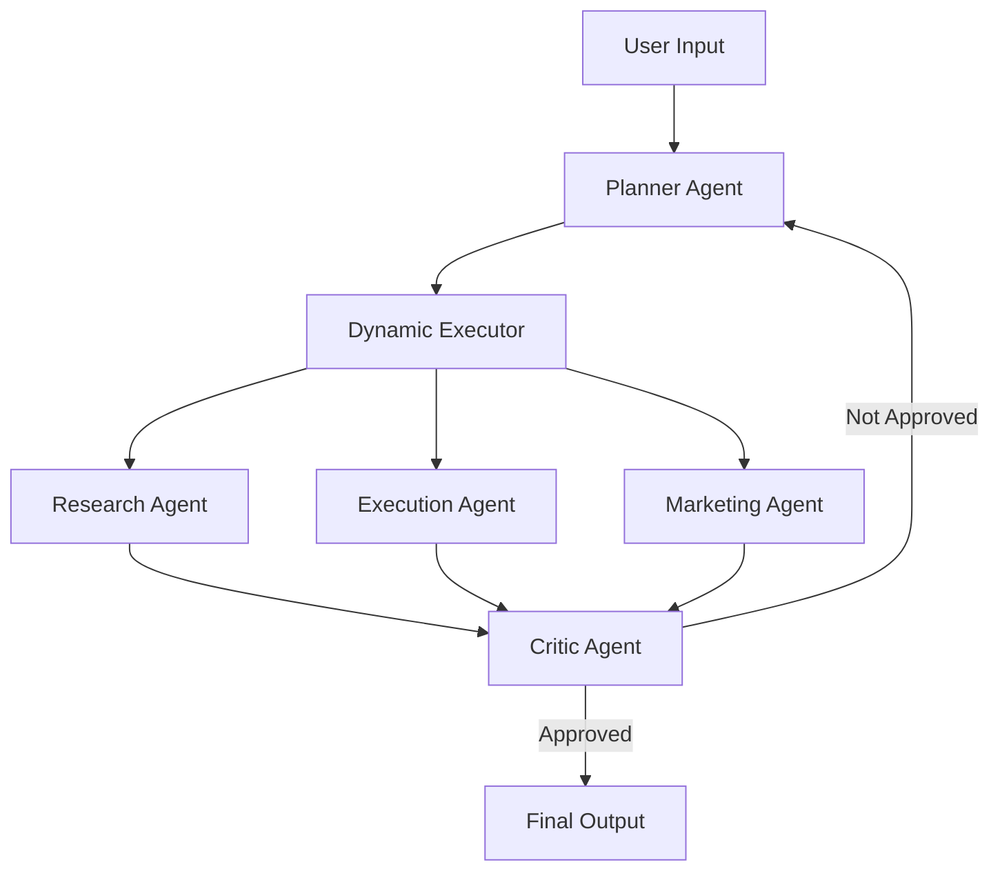

# 🚀 AI Business Co-Pilot

An **Agentic AI System** that transforms a simple business idea into a structured, actionable execution plan using multi-agent workflows powered by LLMs.

---

## 📌 Overview

AI Business Co-Pilot allows users to input a business idea (e.g., *"Start a dropshipping store for fitness products"*) and receive:

* 📊 Market Research Insights
* 🛠️ Execution Strategy
* 📈 Marketing Plan
* 🧪 AI Critique & Validation

---

## 🧠 Key Features

* 💬 Chat-based UI (Streamlit)
* 🤖 Multi-Agent Architecture (Planner, Executor, Critic)
* 🔀 Smart Routing using LLM
* 📜 Persistent History (SQLite)
* 📥 Downloadable Business Reports
* ⚡ Real-time Agent Execution Animation

---

## 🏗️ Architecture



---

## 🔄 Workflow

1. User enters a business idea
2. Planner Agent breaks it into steps
3. Dynamic Executor routes each step to appropriate agent
4. Agents generate outputs (research, execution, marketing)
5. Critic Agent evaluates quality
6. Final structured response returned

---

## 🧩 Tech Stack

| Component | Technology            |
| --------- | --------------------- |
| LLM       | Groq (Qwen / LLaMA)   |
| Framework | LangChain + LangGraph |
| UI        | Streamlit             |
| Database  | SQLite                |
| Vector DB | ChromaDB              |
| Language  | Python                |

---

## 🧠 Agents

### 🔹 Planner Agent

* Converts user input into structured steps

### 🔹 Dynamic Executor

* Routes tasks intelligently using LLM

### 🔹 Research Agent

* Market analysis, trends, competitors

### 🔹 Execution Agent

* Implementation steps and tools

### 🔹 Critic Agent

* Validates and improves output quality

---

## 💾 Memory System

* **Session Memory** → Chat messages
* **SQLite DB** → Persistent history
* **ChromaDB** → Semantic retrieval

---

## 🚀 Installation

```bash
git clone https://github.com/YOUR_USERNAME/ai-business-co-pilot.git
cd ai-business-co-pilot

pip install -r requirements.txt
```

---

## 🔐 Environment Variables

Create `.env` file:

```env
GROQ_API_KEY=your_api_key_here
```

---

## ▶️ Run Locally

```bash
streamlit run app.py
```

---

## 🌐 Deployment

Deployed using **Streamlit Cloud**

Steps:

1. Push code to GitHub
2. Connect repo on Streamlit Cloud
3. Add secrets (`GROQ_API_KEY`)
4. Deploy

---

## 📸 Screenshots

* Chat-based UI
* Agent execution flow
* History sidebar
* Downloadable reports

---

## ⚠️ Challenges Faced

* LLM response inconsistencies
* Handling `<think>` tokens
* Deployment environment issues
* Agent routing accuracy

---

## 🔮 Future Improvements

* Shopify / Stripe integration
* Fully autonomous execution
* Multi-user authentication
* Analytics dashboard
* Fine-tuned models

---

## 🏆 Conclusion

AI Business Co-Pilot demonstrates how **Agentic AI systems** can automate complex business planning tasks using coordinated LLM agents.

---

## 👨‍💻 Author

**Atharav Dhumone**

---

## ⭐ If you like this project

Give it a ⭐ on GitHub!
