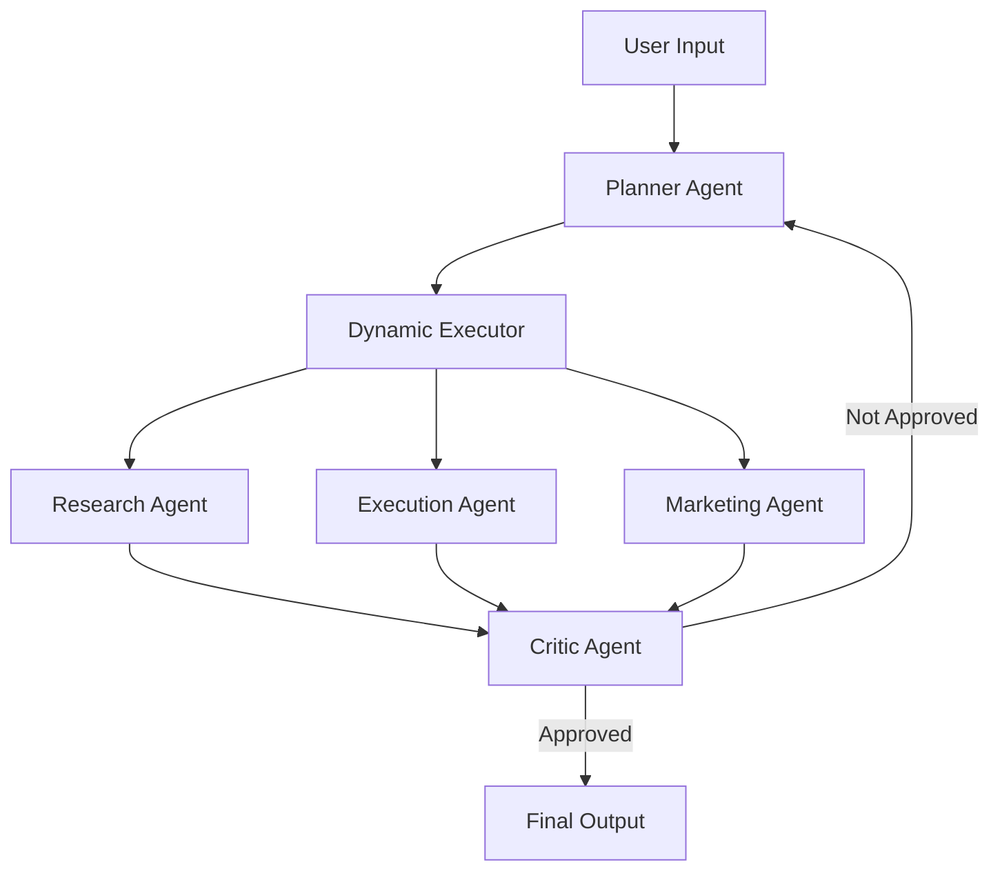

# 🚀 AI Business Co-Pilot

An **Agentic AI System** that transforms a simple business idea into a structured, actionable execution plan using **multi-agent workflows with iterative self-improvement**

---

## 📌 Overview

AI Business Co-Pilot allows users to input a business idea (e.g., *"Start a dropshipping store for fitness products"*) and receive:

* 📊 Market Research Insights
* 🛠️ Execution Strategy
* 📈 Marketing Plan
* 🧪 AI Critique & Iterative Refinement

---

## 🧠 Key Features

* 💬 Chat-based UI (Streamlit)
* 🤖 Multi-Agent Architecture (Planner, Executor, Critic)
* 🔁 Iterative Feedback Loop (self-improving system)
* 🔀 Smart Routing using LLM
* 📜 Persistent History (SQLite)
* 📥 Downloadable Business Reports
* ⚡ Real-time Agent Execution Animation

---

## 🏗️ Architecture



---

## 🔄 Workflow

1. User enters a business idea
2. Planner Agent generates a structured plan
3. Dynamic Executor routes each step to appropriate agents
4. Agents produce outputs (research, execution, marketing)
5. Critic Agent evaluates the result
6. If not approved → feedback is sent back to Planner
7. Planner improves the plan using critique
8. Loop continues until approval or iteration limit

---

## 🔁 Iterative Intelligence (Core Innovation)

Unlike traditional pipelines, this system includes a **feedback-driven loop**:

```text
Planner → Executor → Critic → (feedback) → Planner
```

This enables:

* Self-correction
* Improved outputs over iterations
* More reliable and refined business strategies

---

## 🧩 Tech Stack

| Component | Technology            |
| --------- | --------------------- |
| LLM       | Groq (Qwen / LLaMA)   |
| Framework | LangChain + LangGraph |
| UI        | Streamlit             |
| Database  | SQLite                |
| Vector DB | ChromaDB              |
| Language  | Python                |

---

## 🧠 Agents

### 🔹 Planner Agent

* Converts user input into structured business steps
* Improves plan using critique feedback

### 🔹 Dynamic Executor

* Routes tasks intelligently using LLM
* Decides which agent handles each step

### 🔹 Research Agent

* Market analysis, trends, competitor insights

### 🔹 Execution Agent

* Actionable implementation steps

### 🔹 Marketing Agent

* Growth strategies and outreach

### 🔹 Critic Agent

* Evaluates output quality
* Decides whether to approve or iterate

---

## 💾 Memory System

* **Session Memory** → Chat messages
* **SQLite DB** → Persistent history
* **ChromaDB** → Semantic retrieval (RAG)

---

## 🚀 Installation

```bash
git clone https://github.com/YOUR_USERNAME/ai-business-co-pilot.git
cd ai-business-co-pilot

pip install -r requirements.txt
```

---

## 🔐 Environment Variables

Create a `.env` file:

```env
GROQ_API_KEY=your_api_key_here
```

---

## ▶️ Run Locally

```bash
streamlit run app.py
```

---

## 🌐 Deployment

Deployed using **Streamlit Cloud**

Steps:

1. Push code to GitHub
2. Connect repo on Streamlit Cloud
3. Add secrets (`GROQ_API_KEY`)
4. Deploy

---

## ⚠️ Challenges Faced

* LLM response inconsistencies
* Handling `<think>` tokens
* Deployment environment issues
* Agent routing accuracy
* Implementing iterative feedback loop

---

## 🔮 Future Improvements

* Real API integrations (Shopify, Stripe)
* Fully autonomous execution
* Multi-user authentication
* Analytics dashboard
* Fine-tuned models

---

## 🏆 Conclusion

AI Business Co-Pilot demonstrates how **Agentic AI systems with iterative feedback loops** can automate complex business planning tasks with improved reliability and intelligence.

---

## 👨‍💻 Author

**Atharav Dhumone**

---

## ⭐ If you like this project

Give it a ⭐ on GitHub!
